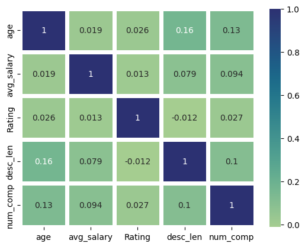
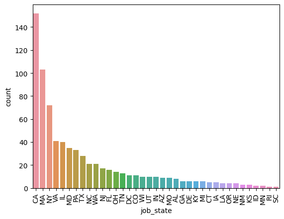
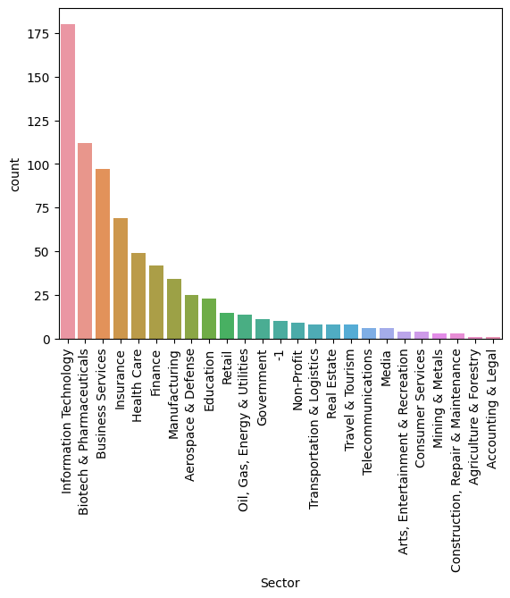
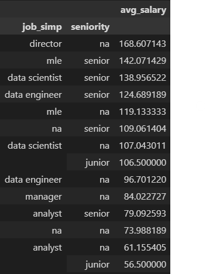

## Job Salary Prediction Model from Glassdoor

## Data Science Salary Estimator: Overview
---
* Created a tool that estimates data science salaries (with MAE ~ 11K) to help data science enthusiasts negotiate their income while job search.
* Scraped over 1000 job descriptions from glassdoor using python and selenium.
* Engineered features from the text of each job description to quantify the value companies put on python, excel, aws, and spark.
* Optimized Linear, Lasso and Random Forest Regressors using GridSearchCV to get the best model.
* A simple client facing API using Flask.

### Resources:
---
**Python:** 3.9.16\
**Packages:** Numpy, Pandas, Scikit-learn, Matplotlib, Seaborn, Flask, Selenium, JSON, Pickle\
**Installing for webframe requirements:** pip install -r requirements.txt\
**Scaper Article:** https://medium.com/@benjaminrohan010/scraping-glassdoor-using-selenium-and-python-2022-bd0065775aec \
**Flask Productionize Article:** https://towardsdatascience.com/productionize-a-machine-learning-model-with-flask-and-heroku-8201260503d2 \

### Web Scraping:
---
Updated and tweaked the above scraper article code to scrape 1000 job postings from GlassDoor. With each job, we get the following:
* Job Title
* Salary Estimate
* Job Description
* Rating
* Company Name
* Location
* Headquarters
* Company Size
* Company Founded Date
* Type of Ownership
* Industry
* Sector
* Revenue
* Competitors

### Data Cleaning:
---
After scraping of the data, it was cleaned up to make it usable for the model. Following changes were made:
* Parsed numeric data out of salary
* Made columns for employer provided salary and hourly wages
* Removed rows without salary
* Parsed rating out of company text
* Made a new company for company state
* Added a column for if the job was at the company's headquarters
* Transformed founded date into age of company
* Made columns for if different skills were listed in the job description:
    + Python
    + R
    + Excel
    + AWS
    + Spark
* Column for simplified Job Title and Seniority
* Column for description length

### EDA:
---
Different techniques used for data exploration. Few highlights are below:

* Correlation Heatmap on the most useful features detemined:\

* Job Postings according to State:\

* Job Postings according to Sector:\

* Pivot Table according to Job Title and Seniority:\

### Model Building:
---
After transforming categorical variables into dummy variables, the data was split into train and test sets with test set being 20% of all the data.\
Three different models were tried with evaluation metric Mean Absolute Error (MAE) as MAE is relatively easy to interpret and outliers are not particularly bad for this type of model.\

Models tried:\
* **Multiple Linear Regression** - Baseline for the model
* **Lasso Regression** - As categorical variables transformed the matrix into a sparse matrix, normalizing regression like Lasso was thought to be effective.
* **Random Forest** - Sparsity of data and multiple categorical variables made Random Forest thought to be a good fit.

### Model Performance:
---
The Random Forest model outperformed the other approches on the test and validation sets.

* **Random Forest**: MAE ~= 14.57
* **Linear Regression**: MAE ~= 18.88
* **Ridge Regression**: MAE ~= 20.49

### Productionization
Flask API endpoint was created on a localhost webserver by following the "Flask Productionize Article" by TDS. API endpoint takes a request with a list of values from a job listing and returns an estimated salary.

